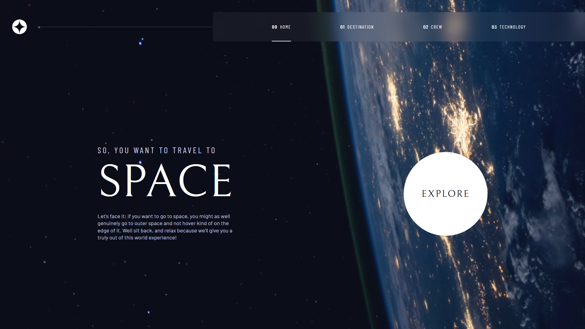

# Space Tourism

[**🚀 View Live Demo**](https://space-tourism.dogukankara.workers.dev)

A multi-page space tourism website offering an interactive and immersive experience where users can explore destinations, meet the crew, and learn about launch technology. Built as an advanced solution to a Frontend Mentor challenge, modernized with a robust, production-ready tech stack and 3D graphics.



## Tech Stack & Features

- **React 19** with **React Compiler** for optimal performance.
- **TypeScript** (Strict mode) for type safety and robust architecture.
- **Vite 7** for a blazing-fast development and build environment.
- **Three.js & React Three Fiber + Drei** for rendering interactive and immersive 3D space elements.
- **TanStack React Router** for file-based routing and automatic code-splitting per route.
- **Tailwind CSS v4.2** — featuring a modern CSS-first config and customized fluid typography using `clamp()`.
- **Cloudflare Workers (Pages)** — automated CI/CD pipeline, Edge routing, and SPA fallback configuration via `wrangler`.
- **Accessibility & SEO** — responsive design, semantic HTML, self-hosted optimized fonts, and proper ARIA integration.

## Pages Overview

| Route          | Description                                                    |
| -------------- | -------------------------------------------------------------- |
| `/`            | Home — immersive hero section with an animated explore button  |
| `/destination` | Interactive planetary destinations (Moon, Mars, Europa, Titan) |
| `/crew`        | Meet our globally recognized crew members                      |
| `/technology`  | Learn about our advanced launch vehicles and capsule tech      |

## Getting Started

### Prerequisites

- Node.js >= 20.19
- pnpm

### Installation

```bash
pnpm install
```

### Development

```bash
pnpm run dev
```

### Production Build

```bash
pnpm run build
```

## Project Structure

```text
src/
├── assets/         # Static data (data.json)
├── components/     # Shared UI (Navigation, Headers)
│   └── three/      # 3D assets and R3F interactive components
├── fonts/          # Self-hosted web fonts
├── lib/            # Utilities (clsx + tailwind-merge helper)
├── routes/         # File-based route pages
├── types.ts        # TypeScript interfaces for robust type checking
└── index.css       # Global styles, Tailwind v4 theme, and responsive backgrounds
```

## Acknowledgements

- UI Design inspired by [Frontend Mentor](https://www.frontendmentor.io/)
- Crew, destination, and technical data inspired by real-life space missions.
